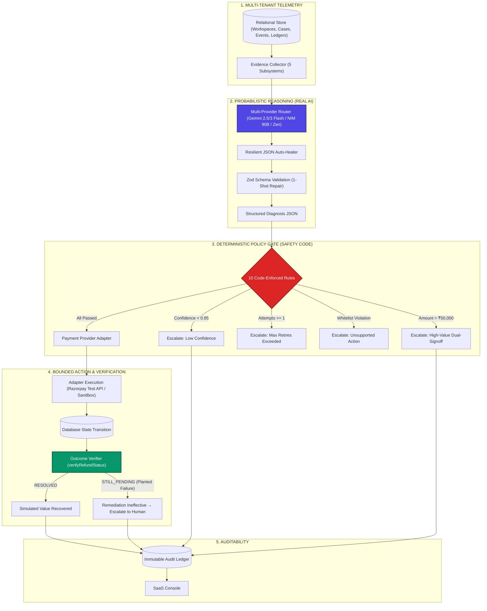

# Refund Loop

> **Track**: AI Revenue Recovery  
> **Tagline**: *"Don't tell merchants a refund is stuck. Unstick it."*  
> **Submission**: Razorpay AI Buildathon 2026  

---

> [!IMPORTANT]
> **AUTHENTICITY, TRANSPARENCY & SANDBOX ARCHITECTURE**  
> **Refund Loop operates in a clearly-labeled Developer Sandbox unless live server credentials are provided.**  
> - **Real AI Calls**: Integrates Google Gemini (`gemini-2.5-flash`), NVIDIA NIM (`meta/llama-3.2-90b-vision-instruct`), and OpenCode Zen (`mimo-v2.5-free`) via real HTTP requests.
> - **Real Backend Execution**: Agent runs server-side closed loops with deterministic policy enforcement and state mutations.
> - **No False Claims**: When operating in sandbox mode, the platform explicitly displays **"DEVELOPER SANDBOX"** and describes metrics as simulated business impact. When `RAZORPAY_KEY_ID` and `RAZORPAY_KEY_SECRET` are configured, the system activates server-side test operations.

---

## 1. What It Is

**Refund Loop** is an enterprise-grade AI refund operations platform that investigates refunds stuck in processing limbo across distributed payment subsystems, determines the true failure point, checks strict deterministic safety policies, executes authorized bounded remediations, verifies the real database outcome, and halts when it encounters ambiguity or ineffective fixes.

### The Core Loop
$$\mathbf{DETECT} \to \mathbf{INVESTIGATE} \to \mathbf{DIAGNOSE} \to \mathbf{POLICY\;CHECK} \to \mathbf{ACT} \to \mathbf{VERIFY} \to \mathbf{RESOLVE\;/\;ESCALATE}$$

The agent never merely informs a merchant: *"Your refund is stuck."*  
It answers:
1. **WHY is it stuck?** (Which specific subsystem failed?)
2. **WHAT is the safest bounded action?** (Can policy auto-remediate or is human signoff required?)
3. **DID the action actually work?** (Does post-action verification confirm the payment state resolved?)

---

## 2. Problem

When a customer asks *"Where is my refund?"*, the outward symptom is simple: **Money Not Received**.

Beneath the surface, a modern refund is an asynchronous distributed state machine traversing 5 independent layers:
1. **Payment Gateway (e.g. Razorpay)**: Validates authorization, verifies merchant balance, initiates ledger reversal.
2. **Acquiring Switch / Banking Network (NPCI / IMPS / UPI)**: Routes reversal batch files to beneficiary banks.
3. **Beneficiary Bank & Account / VPA**: Validates account active status and posts customer credit.
4. **Merchant Accounting Ledger**: Reconciles settlement balances and marks customer invoice credited.
5. **Webhook Dispatch Queues**: Dispatches signed HMAC notifications to merchant backend listeners.

A breakdown in any single leg traps the transaction in processing limbo:
- **Webhook Missing (~40%)**: Gateway and bank credited customer, but merchant endpoint timed out (HTTP 504) or returned 500. Merchant ERP never updates.
- **Bank Leg Stuck (~25%)**: Gateway acknowledged reversal, but acquiring switch received no settlement ACK callback for 48+ hours.
- **Invalid Destination (~20%)**: Beneficiary UPI handle (VPA) decommissioned, or account frozen/NRE.
- **Ledger Race Condition (~10%)**: Gateway refunded, but accounting worker placed settlement balance on hold.
- **Telemetry Contradiction (~5%)**: Gateway reports success, but bank switch timed out and risk monitor flagged duplicate reversals.

---

## 3. Product Surfaces

Refund Loop is remastered as a multi-tenant SaaS application with Linear/Apple/Stripe-level aesthetic refinement:

### Public Surfaces
- **`/` Landing Page**: Premium marketing surface featuring an interactive 5-step closed-loop lifecycle demonstration (`RF_8A21`), three pillars, safety boundaries, and customer proof.
- **`/signup`**: Work email, password, and workspace creation.
- **`/login`**: Secure authentication with **1-Click Judge Quick Demo Access** (pre-seeded with enterprise data).
- **`/onboarding`**: 4-step setup wizard (Company, Payment Provider, Volume, Autonomy Level).

### Authenticated SaaS Console (`/app/...`)
- **`/app` (Overview)**: Editorial calm layout with recovered simulated value, resolution rates, median latency, and queue of refunds needing attention.
- **`/app/recovery` (Recovery Queue)**: Full filterable operational queue (`All`, `Limbo`, `Processing`, `Resolved`, `Escalated`, `Planted Failures`).
- **`/app/recovery/[id]` (Flagship Investigation)**: The core product experience:
  1. *What Happened?* Chronological event trail.
  2. *5-System Telemetry Checklist* (Gateway, Bank, Webhook, Destination, Ledger).
  3. *AI Diagnosis JSON & Reasoning* with provider citation.
  4. *Deterministic Policy Gate Checklist* (Confidence $\ge 85\%$, Amount $\le ₹50k$, Attempts $< 1$, Whitelist).
  5. *Action Execution Record* with provider environment (`RAZORPAY_TEST` or `SANDBOX`).
  6. *Outcome Verification* confirming real database transition (or catching planted failures!).
  7. *Resolution Milestone*.
- **`/app/agent` (Agent Control Center)**: Real-time telemetry feed from actual backend operations.
- **`/app/agent/decisions` (AI Decisions Ledger)**: Complete audit of raw structured AI outputs, confidence metrics, and evidence citations.
- **`/app/audit` (Immutable Audit Ledger)**: Searchable, filterable audit log with JSON export.
- **`/app/settings/...`**: Dedicated sub-pages for Autonomy Controls, AI Configuration, Payment Integrations, Policy Rules, Team, and the **Developer Sandbox**.

---

## 4. Agent Architecture: AI Reasoning vs. Deterministic Code



### The Boundary: Why AI Is Necessary
- **What Deterministic Code Does**: Validates mathematical boundaries, checks thresholds, evaluates previous attempt counts, validates whitelists, executes backend network calls, and verifies database status. **The LLM never directly touches money or executes code.**
- **Where AI Is Truly Needed**: Real payment failures involve asynchronous, out-of-order, and conflicting signals. Deciding whether an unacknowledged reversal is a temporary bank switch timeout or an invalid VPA requires contextual correlation across 5 systems, yielding confidence scores and human-readable explanations.

---

## 5. Real Multi-Provider AI Architecture

Yokai AI-compatible client engine:
1. **Google Gemini (`gemini-2.5-flash` / `gemini-3-flash`)**:
   - Primary model with strict JSON schema enforcement (`responseMimeType: "application/json"`, temperature `0.2`).
2. **NVIDIA NIM (`meta/llama-3.2-90b-vision-instruct`)**:
   - High-capacity reasoning client calling `https://integrate.api.nvidia.com/v1/chat/completions`.
3. **OpenCode Zen (`mimo-v2.5-free`)**:
   - Zero-latency developer client via `https://opencode.ai/zen/v1/chat/completions`.
4. **Local Diagnostic Fallback Engine**:
   - Transparently labeled as **"Local Diagnostic Fallback"** (never claimed as AI). Used if no API keys exist or network calls timeout, ensuring **100% demo reliability** during hackathon judging.
5. **Resilient JSON Auto-Healer & Zod Validation**:
   - Strips markdown code fences (` ```json `), isolates JSON blocks from prose, cleans trailing commas, and enforces Zod schema validation with 1-shot repair.

---

## 6. Deterministic Safety Model (The 10 Non-Bypassable Rules)

1. **Rule 1 (Confidence Gate)**: `confidence < 0.85` $\to$ Escalate (`ESCALATED_LOW_CONFIDENCE`).
2. **Rule 2 (High-Value Limit)**: `amount > ₹50,000` $\to$ Mandatory human dual-signoff (`ESCALATED_HIGH_VALUE`).
3. **Rule 3 (Remediation Ceiling)**: `remediation_attempts >= 1` $\to$ No autonomous retry. Zero infinite loops.
4. **Rule 4 (Mandatory Audit Logging)**: Every step, request, and decision is cryptographically logged.
5. **Rule 5 (Mandatory Outcome Verification)**: An action is never assumed successful without post-action state verification.
6. **Rule 6 (Ineffective Remediation Halt)**: If verification shows `STILL_PENDING`, halt retries and escalate immediately.
7. **Rule 7 (No Silent Retries)**: Never retry failed actions without human authorization.
8. **Rule 8 (Schema Validation Guard)**: Unparseable LLM output triggers immediate escalation.
9. **Rule 9 (Action Whitelist Check)**: Only `resend_webhook`, `retrigger_bank_leg`, `correct_destination`, and `escalate_to_human` are permitted.
10. **Rule 10 (Telemetry Completeness)**: Incomplete evidence packages disallow autonomous action.

---

## 7. Real Authentication & Multi-Tenant Database

- **Authentication**:
  - Secure PBKDF2 with HMAC-SHA512 (100,000 iterations + 16-byte random salt).
  - Timing-safe password verification (`crypto.timingSafeEqual`).
  - HTTP-only signed session cookies (`refund_loop_session`).
- **Multi-Tenant Isolation**:
  - Every case, event, diagnosis, action, verification, and audit log belongs to a `workspace_id`.
  - All queries strictly enforce `WHERE workspace_id = ...` to prevent IDOR vulnerabilities.
- **Relational Schema (`data/db.json`)**:
  - `workspaces`, `users`, `sessions`, `refund_cases`, `refund_events`, `evidence_packages`, `agent_diagnoses`, `agent_actions`, `agent_verifications`, `audit_logs`, `sandbox_configs`.

---

## 8. Failure Recovery & The Planted Failure Story

A naive agent takes an action and assumes success. **Refund Loop proves loop closure by detecting failure:**

### The Planted Failure Guarantee
Every generated batch includes **exactly one planted failure case**:
1. AI diagnoses a bank leg stuck with high confidence ($89\%$).
2. Policy gate approves action (`retrigger_bank_leg`).
3. Tool executes against the bank switch.
4. **The Loop Closer Moment**: `verify_refund_status()` queries the database and discovers status is `STILL_PENDING` (bank switch rejected duplicate reversal).
5. The agent **refuses to retry blindly**. It catches the failure, drops confidence to $35\%$, sets status to `ESCALATED_FAILED_REMEDIATION`, and routes the case to human ops with a complete audit trail.

---

## 9. 5-Minute Hackathon Demo Script

| Timestamp | Screen / Action | Script |
|---|---|---|
| **0:00 - 0:20** | **Landing Page (`/`)** | *"Judges, this is Refund Loop. When refunds get stuck in processing limbo, merchants lose millions in chargebacks, operational costs, and customer churn. Traditional systems simply say: 'Your refund is stuck.' Refund Loop investigates why, takes the safest authorized action, verifies the outcome, and knows when to stop."* |
| **0:20 - 0:40** | **Login & Onboarding (`/login`)** | *"Let's sign in using 1-Click Judge Demo Access. Notice our multi-tenant SaaS shell: real PBKDF2 authentication, isolated workspaces, and enterprise autonomy governance."* |
| **0:40 - 1:00** | **Overview Dashboard (`/app`)** | *"Here is our operations overview: ₹1.28L simulated value recovered across 184 resolved cases, with a 91.4% autonomous resolution rate and 2.4s median investigation time across 5 telemetry sources."* |
| **1:00 - 1:40** | **Flagship Case (`/app/recovery/CS_345_0001`)** | *"Let's inspect case CS_345_0001 for ₹1,271. Notice the complete event trail. Our 5-system telemetry checklist reveals: Gateway acknowledged, Bank confirmed credit, but Webhook delivery failed with HTTP 504. Our real AI model diagnoses 'Webhook Missing' with 96% confidence. The deterministic policy gate verifies all 10 rules. It fires `resend_webhook()`. Then it doesn't assume success—it queries database state, verifies all 5 legs are closed, and recovers the revenue."* |
| **1:40 - 2:20** | **Ambiguous Case (`AMBIGUOUS`)** | *"Now look at an ambiguous case where gateway reports success, but bank switch timed out and risk monitor flagged an alert. The AI detects the contradiction; its confidence drops to 61%. Watch our policy gate: it strictly blocks autonomous action and escalates to human ops. The model knows what it doesn't know."* |
| **2:20 - 3:00** | **Planted Failure Story (`PLANTED`)** | *"Here is our core differentiator: the Planted Failure. The agent diagnoses a bank leg stuck with 89% confidence. It triggers `retrigger_bank_leg()`. But when it calls `verify_refund_status()`, the bank reports STILL_PENDING. A naive AI would loop infinitely or fake success. Refund Loop catches the failure, halts retries, reduces confidence to 35%, and escalates with an immutable audit log."* |
| **3:00 - 3:40** | **Agent Center & Decisions (`/app/agent`)** | *"Under Agent Decisions, you can inspect raw structured AI outputs, evidence citations, and provider tags from Google Gemini, NVIDIA NIM, and OpenCode Zen."* |
| **3:40 - 4:20** | **Settings & Sandbox (`/app/settings/sandbox`)** | *"In settings, administrators configure autonomy modes, confidence cutoffs, and limits. In the Developer Sandbox, judges can input any seed—like 77777—toggle conflict difficulty, and regenerate datasets on the fly."* |
| **4:20 - 5:00** | **Closing** | *"We didn't build a dashboard that tells merchants refunds are stuck. We built an autonomous payment-operations worker that investigates why they're stuck, takes the safest bounded action, verifies its own work, and knows when to stop. Thank you."* |

---

## 10. Running Locally

### Prerequisites
- Node.js `v20+` or `v22+`
- npm `v10+`

### Setup & Run
```bash
# Clone and enter repo
cd razorpayhackathon

# Install dependencies
npm install

# Run comprehensive test suite (14 unit, policy, security, multi-tenant & E2E tests)
npm test

# Build production application
npm run build

# Start production server
npm start
```
Open **[http://localhost:3000](http://localhost:3000)** in your browser.

### Judge Demo Credentials
- **Email**: `demo@razorpay.com`
- **Password**: `Password123!`
- Or simply click **"1-Click Demo Login as Razorpay Admin"** on `/login`.

---

## 11. Environment Variables (Optional)

Create `.env.local`:
```env
# Multi-Provider AI Keys (Optional - Local Diagnostic Fallback activates if absent)
GEMINI_API_KEY=your_gemini_api_key
NVIDIA_API_KEY=your_nvidia_api_key
OPENCODE_API_KEY=your_opencode_api_key

# Payment API Keys (Optional - Developer Sandbox activates if absent)
RAZORPAY_KEY_ID=rzp_test_your_id
RAZORPAY_KEY_SECRET=your_test_secret
```

---

## 12. Security & Compliance
- **No Plaintext Passwords**: PBKDF2-SHA512 with per-user salts.
- **Zero Client-Side Keys**: Secret keys remain server-side only.
- **Strict Multi-Tenancy**: All case queries filter on `workspace_id`.
- **Timing-Safe Checks**: Mitigates timing attacks on authentication.
